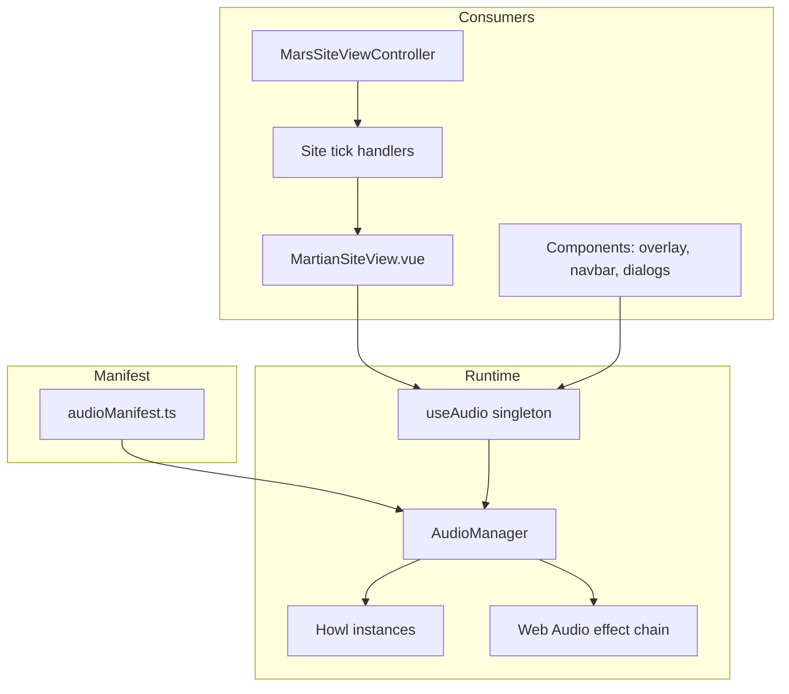

# Game audio architecture (Mars site)

**Scope:** How sound is modeled and triggered in this repo as of the current “sound sprint” work.  
**Stack:** [Howler.js](https://howlerjs.com/) for decoding and playback, with optional **Web Audio** insert chains for voice DSP. **No** audio logic lives in `lib/` — it is centralized under `src/audio/` and wired from Vue + site tick handlers.

---

## 1. Mental model (layers)

| Layer | Role |
|--------|------|
| **Manifest** (`src/audio/audioManifest.ts`) | Single source of truth: stable string ids (`AudioSoundId`), file `src`, **category** (mixer bus), **load** strategy, **playback** mode, default **volume**, **effect** preset. |
| **Types** (`src/audio/audioTypes.ts`) | Categories, playback modes, play options, handles. |
| **Effects** (`src/audio/audioEffects.ts`) | Presets → high-pass / low-pass / WaveShaper chain parameters; `createEffectChain` builds nodes on Howler’s `AudioContext`. |
| **Runtime** (`src/audio/AudioManager.ts`) | Cached `Howl` per static id, `play` / `stopCategory` / `stopSound`, per-instance volume, voice ducking, dynamic `src` for DSN voice, unlock + queued voice. |
| **Access** (`src/audio/useAudio.ts`) | App-wide **singleton** `AudioManager` (tests reset via `resetAudioForTests`). |
| **Gameplay / UI** | `MartianSiteView.vue` implements `MarsSiteViewContext` audio callbacks; `MarsSiteViewController` runs the frame loop and delegates to **tick handlers** in `src/views/site-controllers/`. |

---

## 2. Sound ids and categories

- **Ids** are namespaced strings, e.g. `ui.switch`, `sfx.chemcamFire`, `ambient.rtg`, `voice.dsnTransmission`. The ordered list is `AUDIO_SOUND_IDS`; TypeScript narrows to `AudioSoundId`.
- **Categories** (`AUDIO_CATEGORIES`): `ui`, `voice`, `sfx`, `ambient`, `music`. Each has mixer state: `volume` and `muted` (see `AudioCategoryState`).
- **Instrument-action** subset: `INSTRUMENT_ACTION_SOUND_IDS` — used for gameplay one-shots and held loops that the site controller may **force-stop** on instrument transitions.

---

## 3. Manifest fields (what each cue “means” to the engine)

- **`load`:** `eager` (decode early) vs `lazy` (`Howl` created with `preload: false`, explicitly `load()` on first use) vs `manual` (reserved pattern).
- **`playback`** (applied in `AudioManager.applyPlaybackModePrelude`):
  - **`exclusive-category`** — stop everything else in that category before playing (used for **voice**).
  - **`restart` / `single-instance`** — stop any **active** instance of that **same sound id**, then play.
  - **`overlap`** — allow multiple instances (rare in current manifest).
  - **`rate-limited`** — optional `cooldownMs` + `cooldownKey` in play options.
- **`volume`** — default linear gain (0–1) multiplied by category gain (and ducking where applicable).
- **`effect`** — `none` | `dsn-radio` | `helmet-comms` | `terminal-beep`. Non-`none` inserts a filter + distortion chain **between** Howl’s per-sound gain and Howler’s `masterGain` (only when Web Audio path and play id are available).
- **`allowDynamicSrc`** — only on `voice.dsnTransmission`: no static `src`; caller passes `options.src` at play time (URL from DSN archive / transmission payload).

Static assets are typically under `public/sound/` and referenced as `/sound/....` in the manifest. A few test-oriented ids still use an inlined silent WAV data URI (`SILENT_STATIC_WAV_DATA_URI`).

---

## 4. Runtime behavior highlights

### 4.1 Unlock and autoplay

- `Howler.autoUnlock` is set to **`false`** in `AudioManager` so the app controls when the context resumes.
- `audio.unlock()` sets an internal flag, resumes `Howler.ctx`, and **flushes one queued** dynamic voice play if it was requested while locked (see below).
- `MartianSiteView.vue` registers `keydown` and `pointerdown` listeners that call `unlock()` so the first user gesture satisfies browser autoplay rules.

### 4.2 Dynamic DSN voice while locked

If `play('voice.dsnTransmission', { src })` runs **before** unlock, and the definition allows dynamic `src`, the manager **queues** a single pending voice: `stop()` on the returned handle can cancel before flush; after unlock, the real `play` runs.

### 4.3 Voice ducking

While any **`voice`** playback is active, **`ui`** and **`sfx`** effective category gain is multiplied by `VOICE_DUCK_UI_SFX_MULTIPLIER` (0.55). Entering/leaving voice triggers short **fade** attacks/releases on active ui/sfx instances (`VOICE_DUCK_FADE_ATTACK_MS` / `RELEASE_MS`).

### 4.4 Handles and loops

- `play()` returns `AudioPlaybackHandle`: `stop`, `playing`, `progress`, `duration`, `setVolume`.
- **`loop: true`** in `AudioPlayOptions` sets Howler loop on that **instance**; owners must `stop()` when done (used for held drill/DAN/MastCam sounds, rover drive/turn, UHF uplink, ambient layers).

### 4.5 `onEnd` contract

`onEnd` runs on natural **`end`** and on **load/play failure** (so UI can reset without timeouts). It does **not** run on manual `handle.stop()`.

---

## 5. Wiring: Vue context → controller → tick handlers

`MartianSiteView.vue` builds `MarsSiteViewContext` with:

| Callback | Implementation (typical) |
|----------|---------------------------|
| `playInstrumentActionSound(id)` | `unlock()` + `audio.play(id)` |
| `startInstrumentActionLoop(id)` | `unlock()` + `audio.play(id, { loop: true })` |
| `stopInstrumentActionSound(id)` | `audio.stopSound(id)` |
| `playAmbientLoop(id)` | `audio.play(id, { loop: true })` (no extra unlock here; layers start when tick runs after user activity) |
| `setAmbientVolume(handle, v)` | `handle.setVolume(v)` |
| `onDSNTransmissionsReceived(txs)` | Toast, stop prior voice handle, play `sfx.dsnIncoming`, chain `voice.dsnTransmission` via `onEnd` when first tx has `audioUrl` |

`createMarsSiteTickHandlers(ctx)` wires **per-instrument** sounds:

| Handler | Sounds |
|---------|--------|
| DAN | Loops: `sfx.danScan`, `sfx.danProspecting` |
| Drill | Loops: `sfx.drillStart`, `sfx.mastMove` |
| MastCam | Loops: `sfx.mastcamTag`, `sfx.cameraMove` |
| ChemCam | Loops: `sfx.chemcamFire`, `sfx.cameraMove` |
| APXS | One-shot: `sfx.apxsContact`; loop: `sfx.mastMove` |
| Antenna | `sfx.uhfLock`, loop `sfx.uhfUplink`, `sfx.lgaUplink` |
| Passive systems audio | Ambient loops: `ambient.rtg`, `ambient.heater`, `ambient.rems`; one-shot `sfx.heaterOff` on heater edge |
| Mic (weather ambience) | Loops: `ambient.base`, `ambient.day`, `ambient.night`, `ambient.winds`, `ambient.storm`, `ambient.quake` (gated on `micEnabled`) |
| Rover movement | Loops: `sfx.roverDrive`, `sfx.roverTurn`; one-shot `sfx.roverTurnOut` on turn release |

### 5.1 Hard stop on leaving “active” instrument mode

`MarsSiteViewController` compares previous vs next `{ mode, instrumentId }` each frame and calls `stopInstrumentActionSound` for ids from `getExitedActiveInstrumentSoundIds` when the player **exits** active instrument mode or **switches** instrument. That maps:

- `mastcam` → `sfx.mastcamTag`, `sfx.cameraMove`
- `chemcam` → `sfx.chemcamFire`, `sfx.cameraMove`
- `drill` → `sfx.drillStart`, `sfx.mastMove`
- `apxs` → `sfx.apxsContact`, `sfx.mastMove`

This is a **second boundary** alongside each handler’s own cleanup so loops do not survive Escape / toolbar switches.

---

## 6. UI-only call sites (components)

Components call `useAudio()` directly for short **ui** cues:

- **`InstrumentOverlay.vue`** — `ui.switch` (tab / navigation).
- **`MartianSiteNavbar.vue`** — `ui.confirm`.
- **`ScienceLogDialog.vue`** — `ui.science`.
- **`DSNArchiveDialog.vue`** + **`dsnArchivePlayback.ts`** — `unlock()`, `ui.dsnArchivePlay`, then `voice.dsnTransmission` with row `audioUrl`; dialog uses handle `progress` / `duration` for UI.

Other Vue-level cues in **`MartianSiteView.vue`** include `ui.instrument` (instrument slot change), `ui.switch` (activate instrument), `sfx.rtgOverdrive`, `sfx.rtgShunt`.

---

## 7. Files to read first

| File | Why |
|------|-----|
| `src/audio/audioManifest.ts` | All ids, paths, playback modes |
| `src/audio/AudioManager.ts` | Playback, cache, ducking, effects, unlock queue |
| `src/audio/audioTypes.ts` | Modes and option semantics |
| `src/views/site-controllers/createMarsSiteTickHandlers.ts` | Sound id wiring table |
| `src/views/MarsSiteViewController.ts` | `getExitedActiveInstrumentSoundIds`, frame loop |
| `src/views/MartianSiteView.vue` | Context callbacks, DSN chain, global unlock |
| `src/components/dsnArchivePlayback.ts` | Archive “click to play” sequence |

---

## 8. Tests

- `src/audio/__tests__/AudioManager.test.ts` — manager behavior.
- `src/audio/__tests__/audioManifest.test.ts` — manifest invariants.
- `src/views/site-controllers/__tests__/instrumentActionSounds.test.ts` — handler wiring expectations.
- `src/components/__tests__/dsnArchivePlayback.test.ts` — archive playback helper.

This document describes **current** behavior; when adding a cue, register it in **`audioManifest.ts`**, prefer **`InstrumentActionSoundId`** for anything that must participate in **`stopSound`** / exit cleanup, and trigger via **`useAudio()`** or the existing context callbacks so unlock and category rules stay consistent.
